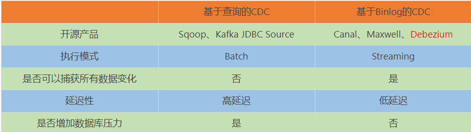
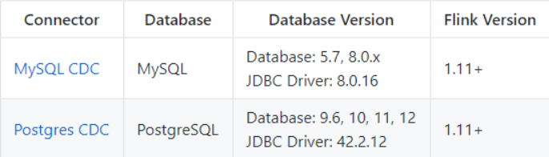
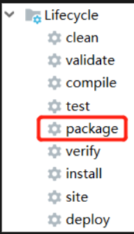
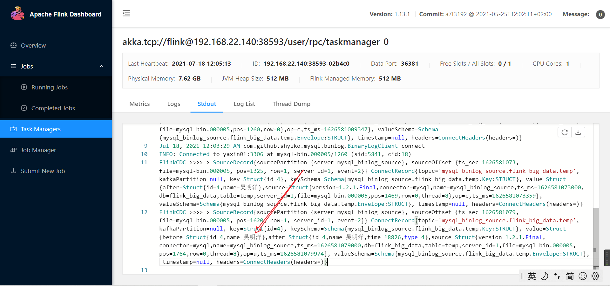

# Flink-CDC

## 第1章 CDC简介

### 1.1 什么是CDC

~~~properties
CDC,Change Data Capture,变更数据获取的简称，使用CDC我们可以从数据库中获取已提交的更改并将这些更改发送到下游，供下游使用。这些变更可以包括INSERT,DELETE,UPDATE等，

用户可以在以下的场景下使用CDC：

使用flink sql进行数据同步,可以将数据从一个数据同步到其他的地方，比如mysql、elastic　search等。
可以在源数据库上实时的物化一个聚合视图
因为只是增量同步，所以可以实时的低延迟的同步数据
使用EventTime join 一个temporal表以便可以获取准确的结果
flink 1.11 将这些changelog提取并转化为table apa和sql，目前支持两种格式：Debezium和Canal，这就意味着源表不仅仅是append操作，而且还有upsert、delete操作。

CDC是Change Data Capture(变更数据获取)的简称。核心思想是，监测并捕获数据库的变动（包括数据或数据表的插入、更新以及删除等），将这些变更按发生的顺序完整记录下来，写入到消息中间件中以供其他服务进行订阅及消费。
~~~

### 1.2 CDC的种类

CDC主要分为基于查询和基于Binlog两种方式，我们主要了解一下这两种之间的区别：

### 1.3 Flink-CDC

Flink社区开发了 flink-cdc-connectors 组件，这是一个可以直接从 MySQL、PostgreSQL 等数据库直接读取全量数据和增量变更数据的 source 组件。

目前也已开源，开源地址：https://github.com/ververica/flink-cdc-connectors

## 第2章 FlinkCDC案例实操

### 2.1 DataStream方式的应用

#### 2.1.1 导入依赖

~~~xml
<dependencies>
    <dependency>
        <groupId>org.apache.flink</groupId>
        <artifactId>flink-java</artifactId>
        <version>1.13.1</version>
    </dependency>

    <dependency>
        <groupId>org.apache.flink</groupId>
        <artifactId>flink-streaming-java_2.11</artifactId>
        <version>1.13.1</version>
    </dependency>

    <dependency>
        <groupId>org.apache.flink</groupId>
        <artifactId>flink-clients_2.11</artifactId>
        <version>1.13.1</version>
    </dependency>

    <dependency>
        <groupId>org.apache.hadoop</groupId>
        <artifactId>hadoop-client</artifactId>
        <version>3.1.3</version>
    </dependency>

    <dependency>
        <groupId>mysql</groupId>
        <artifactId>mysql-connector-java</artifactId>
        <version>5.1.49</version>
    </dependency>

    <dependency>
        <groupId>com.alibaba.ververica</groupId>
        <artifactId>flink-connector-mysql-cdc</artifactId>
        <version>1.1.1</version>
    </dependency>
    <dependency>
        <groupId>com.alibaba</groupId>
        <artifactId>fastjson</artifactId>
        <version>1.2.75</version>
    </dependency>
</dependencies>
~~~

#### 2.1.2 编写代码

~~~java
package com.wmy.flink.cdc.base;

import com.alibaba.ververica.cdc.connectors.mysql.MySQLSource;
import com.alibaba.ververica.cdc.debezium.DebeziumDeserializationSchema;
import com.alibaba.ververica.cdc.debezium.DebeziumSourceFunction;
import com.alibaba.ververica.cdc.debezium.StringDebeziumDeserializationSchema;
import org.apache.flink.api.common.restartstrategy.RestartStrategies;
import org.apache.flink.runtime.state.filesystem.FsStateBackend;
import org.apache.flink.streaming.api.CheckpointingMode;
import org.apache.flink.streaming.api.datastream.DataStreamSource;
import org.apache.flink.streaming.api.environment.CheckpointConfig;
import org.apache.flink.streaming.api.environment.StreamExecutionEnvironment;

import java.util.Properties;

/**
 * ClassName:FlinkCDC
 * Package:com.wmy.flink.cdc.base
 *
 * @date:2021/7/18 9:26
 * @author:数仓开发工程师
 * @email:2647716549@qq.com
 * @Description: Flink CDC 案例
 */
public class FlinkCDC {
    public static void main(String[] args) throws Exception {
        // 1、获取执行环境
        StreamExecutionEnvironment env = StreamExecutionEnvironment.getExecutionEnvironment();
        env.setParallelism(1);

        // 2、Checkpoint
        // 2.1 开启checkpoint，每隔5秒钟做一次checkpoint
        //env.enableCheckpointing(5000L);

        // 2.2 指定checkpoint一次性语义
        //env.getCheckpointConfig().setCheckpointingMode(CheckpointingMode.EXACTLY_ONCE);

        // 2.3 设置任务关闭保留最后一次checkpoint数据
        //env.getCheckpointConfig().enableExternalizedCheckpoints(CheckpointConfig.ExternalizedCheckpointCleanup.RETAIN_ON_CANCELLATION);

        // 2.4 指定checkpoint自动重启策略
        //env.setRestartStrategy(RestartStrategies.fixedDelayRestart(3, 2000L));

        // 2.5 设置状态后端
        //env.setStateBackend(new FsStateBackend("hdfs://yaxin01:9820/flink/flink-cdc/ck"));

        // 2.6 设置用户名
        //System.setProperty("HADOOP_USER_NAME", "root");

        // 3、创建MySQL CDC Source
        Properties props = new Properties();
        props.setProperty("debezium.snapshot.mode", "initial");
        DebeziumSourceFunction<String> sourceFunction = MySQLSource.<String>builder()
                .hostname("yaxin01")
                .port(3306)
                .username("root")
                .password("000000")
                .databaseList("flink_big_data")
                .tableList("flink_big_data.temp") // 注意：可选配置项，必须使用库名.表名
                .serverTimeZone("Asia/Shanghai")
                .deserializer(new StringDebeziumDeserializationSchema())
                .debeziumProperties(props)
                .build();

        // 4、读取MySQL 数据
        DataStreamSource<String> streamSource = env.addSource(sourceFunction);

        // 5、输出到外部系统
        streamSource.print("FlinkCDC >>>> ");

        // 6、执行任务
        env.execute("FlinkCDC >>>> ");
    }
}
~~~

#### 2.1.3 案例测试

log-bin=mysql-bin #添加这一行就 ok   
binlog-format=ROW #选择 row 模式    
binlog-do-db=yaxin

##### 1）打包并上传至Linux

##### 2）开启MySQL Binlog并重启MySQL

##### 3）启动Flink集群

##### 4）启动HDFS集群

##### 5）启动程序

flink run -c com.wmy.flink.cdc.base.FlinkCDC flink-cdc-1.0-SNAPSHOT-jar-with-dependencies.jars

##### 6）在MySQL的表中添加、修改或者删除数据

测试成功

##### 7）给当前的Flink程序创建Savepoint

flink run -savepoint id hdfs://yaxin01:9820/flink-cdc/ck

##### 8）关闭程序以后从Savepoint重启程序

### 2.2 FlinkSQL方式的应用

#### 2.2.1 添加依赖

~~~xml
<dependency>
    <groupId>org.apache.flink</groupId>
    <artifactId>flink-table-planner-blink_2.12</artifactId>
    <version>1.12.0</version>
</dependency>
~~~

#### 2.2.2 代码实现

~~~java
import org.apache.flink.api.common.restartstrategy.RestartStrategies;import org.apache.flink.runtime.state.filesystem.FsStateBackend;import org.apache.flink.streaming.api.CheckpointingMode;import org.apache.flink.streaming.api.environment.CheckpointConfig;import org.apache.flink.streaming.api.environment.StreamExecutionEnvironment;import org.apache.flink.table.api.bridge.java.StreamTableEnvironment;
public class FlinkSQL_CDC {

    public static void main(String[] args) throws Exception {

        //1.创建执行环境
        StreamExecutionEnvironment env = StreamExecutionEnvironment.getExecutionEnvironment();
        env.setParallelism(1);
        StreamTableEnvironment tableEnv = StreamTableEnvironment.create(env);
        //2.创建Flink-MySQL-CDC的Source
        tableEnv.executeSql("CREATE TABLE user_info (" +
                            "  id INT," +
                            "  name STRING," +
                            "  phone_num STRING" +
                            ") WITH (" +
                            "  'connector' = 'mysql-cdc'," +
                            "  'hostname' = 'hadoop102'," +
                            "  'port' = '3306'," +
                            "  'username' = 'root'," +
                            "  'password' = '000000'," +
                            "  'database-name' = 'gmall-flink-200821'," +
                            "  'table-name' = 'z_user_info'" +
                            ")");

        tableEnv.executeSql("select * from user_info").print();

        env.execute();

    }

}
~~~

### 2.3 自定义反序列化器

#### 2.3.1 代码实现

~~~java
import com.alibaba.fastjson.JSONObject;import com.alibaba.ververica.cdc.connectors.mysql.MySQLSource;import com.alibaba.ververica.cdc.debezium.DebeziumDeserializationSchema;import com.alibaba.ververica.cdc.debezium.DebeziumSourceFunction;import io.debezium.data.Envelope;import org.apache.flink.api.common.restartstrategy.RestartStrategies;import org.apache.flink.api.common.typeinfo.TypeInformation;import org.apache.flink.runtime.state.filesystem.FsStateBackend;import org.apache.flink.streaming.api.CheckpointingMode;import org.apache.flink.streaming.api.datastream.DataStreamSource;import org.apache.flink.streaming.api.environment.CheckpointConfig;import org.apache.flink.streaming.api.environment.StreamExecutionEnvironment;import org.apache.flink.util.Collector;import org.apache.kafka.connect.data.Field;import org.apache.kafka.connect.data.Struct;import org.apache.kafka.connect.source.SourceRecord;
import java.util.Properties;
public class Flink_CDCWithCustomerSchema {

    public static void main(String[] args) throws Exception {

        //1.创建执行环境
        StreamExecutionEnvironment env = StreamExecutionEnvironment.getExecutionEnvironment();
        env.setParallelism(1);

        //2.创建Flink-MySQL-CDC的Source
        Properties properties = new Properties();

        //initial (default): Performs an initial snapshot on the monitored database tables upon first startup, and continue to read the latest binlog.
        //latest-offset: Never to perform snapshot on the monitored database tables upon first startup, just read from the end of the binlog which means only have the changes since the connector was started.
        //timestamp: Never to perform snapshot on the monitored database tables upon first startup, and directly read binlog from the specified timestamp. The consumer will traverse the binlog from the beginning and ignore change events whose timestamp is smaller than the specified timestamp.
        //specific-offset: Never to perform snapshot on the monitored database tables upon first startup, and directly read binlog from the specified offset.
        properties.setProperty("debezium.snapshot.mode", "initial");
        DebeziumSourceFunction<String> mysqlSource = MySQLSource.<String>builder()
            .hostname("hadoop102")
            .port(3306)
            .username("root")
            .password("000000")
            .databaseList("gmall-flink-200821")
            .tableList("gmall-flink-200821.z_user_info")         //可选配置项,如果不指定该参数,则会读取上一个配置下的所有表的数据,注意：指定的时候需要使用"db.table"的方式
            .debeziumProperties(properties)
            .deserializer(new DebeziumDeserializationSchema<String>() {  //自定义数据解析器
                @Override
                public void deserialize(SourceRecord sourceRecord, Collector<String> collector) throws Exception {

                    //获取主题信息,包含着数据库和表名  mysql_binlog_source.gmall-flink-200821.z_user_info
                    String topic = sourceRecord.topic();
                    String[] arr = topic.split("\\.");
                    String db = arr[1];
                    String tableName = arr[2];

                    //获取操作类型 READ DELETE UPDATE CREATE
                    Envelope.Operation operation = Envelope.operationFor(sourceRecord);

                    //获取值信息并转换为Struct类型
                    Struct value = (Struct) sourceRecord.value();

                    //获取变化后的数据
                    Struct after = value.getStruct("after");

                    //创建JSON对象用于存储数据信息
                    JSONObject data = new JSONObject();
                    for (Field field : after.schema().fields()) {
                        Object o = after.get(field);
                        data.put(field.name(), o);
                    }

                    //创建JSON对象用于封装最终返回值数据信息
                    JSONObject result = new JSONObject();
                    result.put("operation", operation.toString().toLowerCase());
                    result.put("data", data);
                    result.put("database", db);
                    result.put("table", tableName);

                    //发送数据至下游
                    collector.collect(result.toJSONString());
                }

                @Override
                public TypeInformation<String> getProducedType() {
                    return TypeInformation.of(String.class);
                }
            })
            .build();

        //3.使用CDC Source从MySQL读取数据
        DataStreamSource<String> mysqlDS = env.addSource(mysqlSource);

        //4.打印数据
        mysqlDS.print();

        //5.执行任务
        env.execute();
    }
}
~~~

## 第3章 debezium

[Debezium Connector for MySQL :: Debezium Documentation](https://debezium.io/documentation/reference/1.2/connectors/mysql.html#mysql-connector-configuration-properties_debezium)

## 第4章 Flink CDC Demo案例

### 4.1 博客案例

[mysql增量同步kafka_基于 Flink SQL CDC 的实时数据同步方案_NT xing的博客-CSDN博客](https://blog.csdn.net/weixin_28994767/article/details/112227984)

### 4.2 Flink SQL 对接kafka

~~~properties
CREATE TABLE kafkaTable (
 id int,
 name String,
 sex String
) WITH (
 'connector' = 'kafka',	
 'topic' = 'flink_sql_kafka',
 'properties.bootstrap.servers' = 'yaxin01:9092',
 'properties.group.id' = 'flink-kafka',
 'format' = 'csv',
 'scan.startup.mode' = 'earliest-offset'
);

1,吴明洋,男
2,龙昌辉,男
~~~

### 4.3 Flink SQL对接hive

### 4.4 Flink SQL对接MySQL

